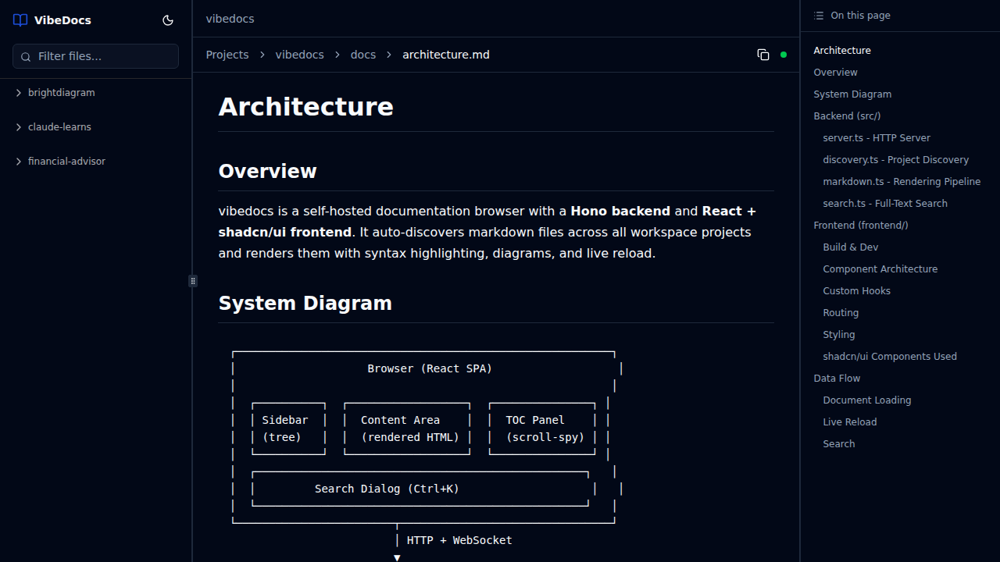

```
                     (
              )      )\ )
 (   (  (  ( /(   ( (()/(
 )\  )\ )\ )\()) ))\ /(_))  (   (  (
((_)((_|(_|(_)\ /((_|_))_   )\  )\ )\
\ \ / / (_) |(_|_))  |   \ ((_)((_|(_)
 \ V /  | | '_ Y -_) | |) / _ Y _|(_-<
  \_/   |_|_.__|___| |___/\___|__|/__/
```

Self-hosted markdown documentation browser with live reload, syntax highlighting, and full-text search.

**Built entirely with [Claude Code](https://claude.ai/code)**



## Features

- **Auto-discovery** — point at a directory of projects and VibeDocs finds all markdown files
- **Live reload** — edits to `.md` files appear instantly via WebSocket
- **Syntax highlighting** — Shiki with dual light/dark themes (github-light / github-dark)
- **Mermaid diagrams** — fenced ` ```mermaid ` blocks render as diagrams
- **Full-text search** — Ctrl+K command palette with instant results
- **Table of contents** — auto-generated from headings with scroll-spy
- **Dark/light/system themes** — toggle with one click
- **Collapsible sidebar** — file tree with filtering, resizable panel
- **GFM support** — tables, task lists, strikethrough, autolinks

## Quick Start

```bash
git clone https://github.com/danielcbright/vibedocs.git
cd vibedocs
npm install
npm run build
```

Run it, pointing at a directory that contains project folders:

```bash
VIBEDOCS_ROOT=/path/to/your/projects npm start
```

Open http://localhost:8080.

## Configuration

| Variable | Default | Description |
|----------|---------|-------------|
| `VIBEDOCS_ROOT` | current working directory | Root directory to scan for projects |
| `VIBEDOCS_PORT` or `PORT` | `8080` | Port to listen on |

## Directory Structure

VibeDocs expects `VIBEDOCS_ROOT` to contain project directories, each with markdown files:

```
$VIBEDOCS_ROOT/
├── project-a/
│   ├── README.md
│   ├── CLAUDE.md
│   └── docs/
│       ├── getting-started.md
│       └── api-reference.md
├── project-b/
│   ├── README.md
│   └── docs/
│       └── architecture.md
└── ...
```

Each subdirectory becomes a "project" in the sidebar. Root-level `.md` files and everything under `docs/` are displayed.

## Development

```bash
npm run dev   # Starts Hono backend (8080) + Vite dev server (5173)
```

The Vite dev server proxies `/api/*` to the backend, giving you hot module reload for frontend changes and auto-restart for backend changes.

```bash
npm run dev:server    # Backend only
npm run dev:frontend  # Frontend only
```

## Tech Stack

- **Backend:** [Hono](https://hono.dev/) + TypeScript + Node.js
- **Frontend:** React 19 + Vite + [shadcn/ui](https://ui.shadcn.com/) + Tailwind CSS v4
- **Markdown:** unified / remark / rehype pipeline
- **Syntax Highlighting:** [Shiki](https://shiki.style/)
- **Diagrams:** [Mermaid.js](https://mermaid.js.org/) (client-side)
- **Live Reload:** [chokidar](https://github.com/paulmillr/chokidar) + WebSocket

## Deployment

VibeDocs is designed to run as a persistent service. A systemd unit file is included in `systemd/vibedocs.service` — edit the paths and run `scripts/setup-service.sh` to install it.

See `scripts/promote.sh` for a build-validate-restart workflow.

## How Claude Built This

VibeDocs was built entirely using [Claude Code](https://claude.ai/code) — Anthropic's agentic coding tool. Every line of code, from the Hono backend and unified markdown pipeline to the React frontend with shadcn/ui components, was generated through conversational prompts with Claude.

The project started as a simple documentation viewer and grew iteratively: discovery and rendering first, then search, live reload, theming, table of contents, and UI polish — all driven by natural language requests. The `CLAUDE.md` file in this repo serves as project memory, helping Claude understand the codebase architecture across sessions.

## License

[MIT](LICENSE)
