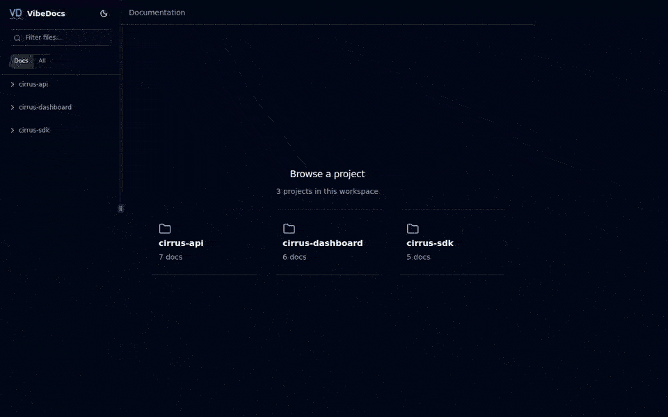
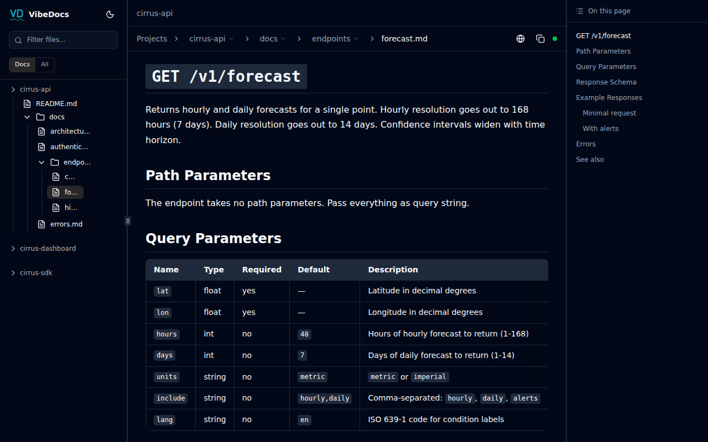
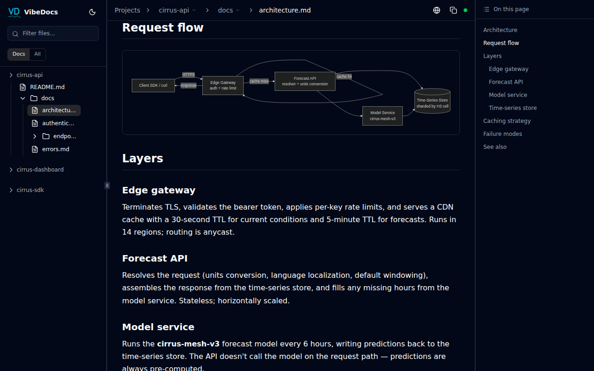
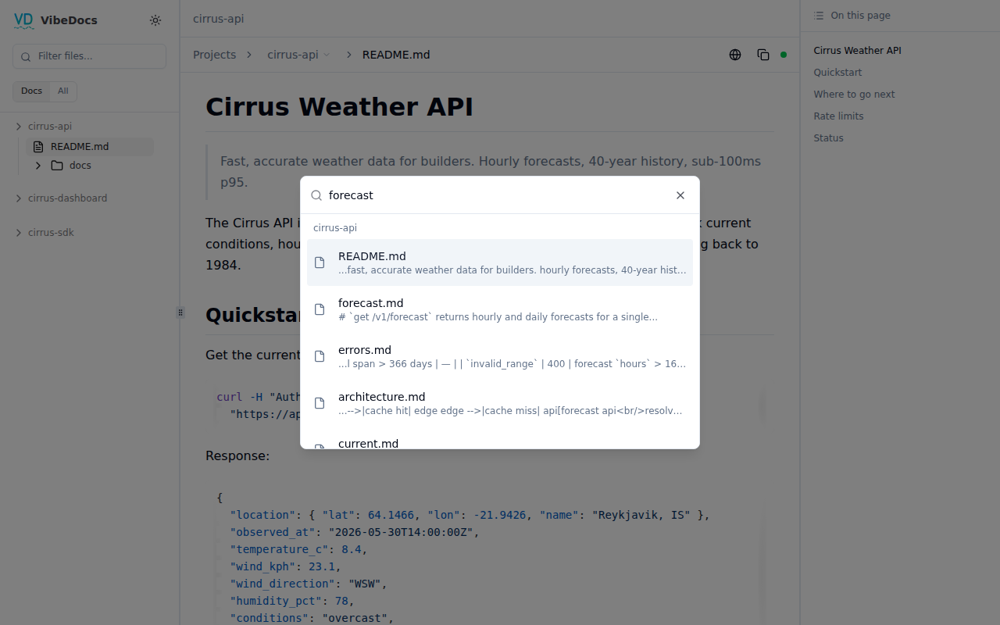
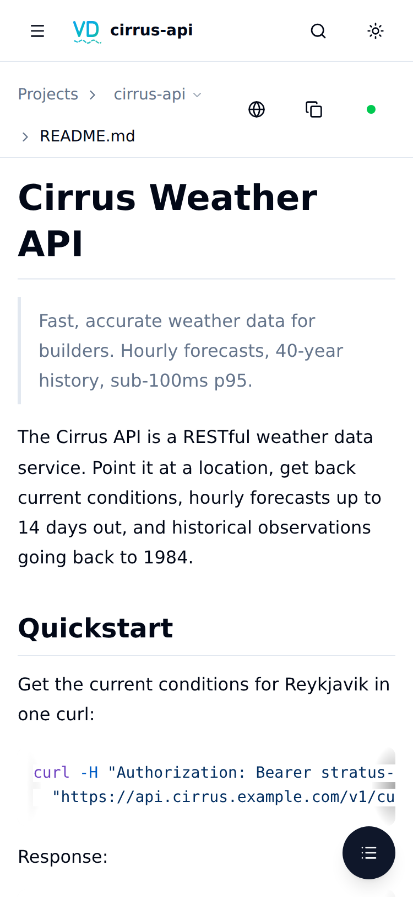

```
                     (
              )      )\ )
 (   (  (  ( /(   ( (()/(
 )\  )\ )\ )\()) ))\ /(_))  (   (  (
((_)((_|(_|(_)\ /((_|_))_   )\  )\ )\
\ \ / / (_) |(_|_))  |   \ ((_)((_|(_)
 \ V /  | | '_ Y -_) | |) / _ Y _|(_-<
  \_/   |_|_.__|___| |___/\___|__|/__/
```

> Self-hosted markdown documentation browser. Live mode for editing, static-build mode for publishing. Built in collaboration with Claude Code.

[](https://github.com/danielcbright/vibedocs/releases)
[](LICENSE)
[](https://claude.ai/code)



## Quick start

```bash
npm install -g github:danielcbright/vibedocs
vibedocs --root ./demo
```

Open <http://localhost:8080>. That's it.

The repo ships with a `demo/` workspace (three fictional Cirrus Weather projects) so you can try the app without your own markdown:

```bash
git clone https://github.com/danielcbright/vibedocs.git
cd vibedocs
VIBEDOCS_ROOT=$(pwd)/demo npm start
```

## What you get

- **Auto-discovery** — point at a directory of projects and VibeDocs finds the markdown
- **Live reload** — edits to `.md` files appear instantly via WebSocket
- **Syntax highlighting** — Shiki with dual light/dark themes

  

- **Mermaid diagrams** — fenced ` ```mermaid ` blocks render inline

  

- **Full-text search** — Ctrl+K command palette with instant results

  

- **Mobile-first layout** — hamburger drawer + bottom-sheet TOC

  

- **Table of contents** — auto-generated from headings with scroll-spy
- **Dark / light / system theme** — toggle in one click
- **File upload** (opt-in) — bearer-token-gated upload endpoint, hidden when disabled
- **GFM** — tables, task lists, strikethrough, autolinks

## Two render modes

VibeDocs has two ways to serve docs:

| Mode | Command | Use for |
|---|---|---|
| **Live** | `npm start` (or `vibedocs`) | The interactive app — search, live reload, theme toggle. Run it against a directory you're actively editing. |
| **Static build** | `npx vibedocs build --serve` | Publish to a static host. Outputs plain HTML with rendered Shiki + tables. Add `--hydration minimal` to ship ~500 KB less JS per page (no search dialog, system theme only). |

Both modes share the same renderer (one source of truth for HTML output).

## How it works

A thin Hono backend watches files, owns the AppState (single in-memory source of project trees + render results), and serves rendered HTML. A React 19 frontend reads from it. Inter-doc links are normalized in a single pass by the URL Rewriter — same code path for both render modes. See [`CONTEXT.md`](CONTEXT.md) for the domain language and [ADR-0001](docs/adr/0001-appstate-shape.md) for the AppState shape rationale.

## Demo workspace

The `demo/` directory ships with three fictional projects so you can try VibeDocs without setting up your own:

- **`cirrus-api/`** — REST API reference with mermaid diagrams, error tables, and per-endpoint pages
- **`cirrus-sdk/`** — TypeScript / Python / Go SDK docs with typed code samples
- **`cirrus-dashboard/`** — UI component library docs with prop tables and design tokens

```bash
VIBEDOCS_ROOT=$(pwd)/demo npm start
```

The demo content is entirely fictional (`stratus-key-DEMO-12345`, `https://api.cirrus.example.com`). Nothing in it references a real product.

## Configuration

| Variable | Default | Description |
|---|---|---|
| `VIBEDOCS_ROOT` | current working directory | Root directory to scan for projects |
| `VIBEDOCS_PORT` or `PORT` | `8080` | Port to listen on |
| `VIBEDOCS_WS_ALLOWED_ORIGINS` | _(unset)_ | Comma-separated extra Origin allowlist for the WebSocket handshake. Defaults cover `localhost`. |
| `VIBEDOCS_WS_ALLOW_NO_ORIGIN` | `false` | Accept WS handshakes with no `Origin` header (non-browser clients) |
| `VIBEDOCS_UPLOAD_TOKEN` | _(unset)_ | Bearer token gating `POST /api/upload/*`. When unset, upload endpoint 404s. |
| `VIBEDOCS_READ_ONLY` | `false` | Force read-only mode — upload endpoint 404s even with a valid token |
| `VIBEDOCS_UPLOAD_MAX_BYTES` | `10485760` (10 MB) | Per-file upload size cap |

## Directory layout

`VIBEDOCS_ROOT` should contain project directories, each with markdown files:

```
$VIBEDOCS_ROOT/
├── project-a/
│   ├── README.md
│   ├── CLAUDE.md
│   └── docs/
│       ├── getting-started.md
│       └── api-reference.md
├── project-b/
│   ├── README.md
│   └── docs/
│       └── architecture.md
└── ...
```

Each subdirectory becomes a "project" in the sidebar. Root-level `.md` files and everything under `docs/` are displayed.

## Development

```bash
npm run dev   # Backend (8080) + Vite dev server (5173) with HMR
```

The Vite dev server proxies `/api/*` to the backend, giving you hot module reload for frontend changes and auto-restart for backend changes.

```bash
npm run dev:server    # Backend only
npm run dev:frontend  # Frontend only
npm test              # Run tests (vitest)
npm run build         # Build the frontend bundle
```

## Tech stack

- **Backend:** [Hono](https://hono.dev/) + TypeScript + Node.js 20+
- **Frontend:** React 19 + Vite + [shadcn/ui](https://ui.shadcn.com/) + Tailwind CSS v4
- **Markdown:** unified / remark / rehype pipeline
- **Syntax highlighting:** [Shiki](https://shiki.style/) (dual-theme via CSS variables)
- **Diagrams:** [Mermaid.js](https://mermaid.js.org/) (lazy-loaded, zero cost on diagram-free pages)
- **Live reload:** [chokidar](https://github.com/paulmillr/chokidar) + WebSocket

## Deployment

VibeDocs is designed to run as a persistent service. A systemd unit file is included in `systemd/vibedocs.service` — edit the paths and run `scripts/setup-service.sh` to install it.

See `scripts/promote.sh` for a build-validate-restart workflow.

When exposing beyond localhost (tailnet, LAN, public), set `VIBEDOCS_WS_ALLOWED_ORIGINS` to every URL the browser will load the app from — otherwise live reload silently fails (this is intentional: it blocks cross-site WebSocket hijacking).

## Documentation

- [`CONTEXT.md`](CONTEXT.md) — domain language and architecture overview (AppState seam, ports/adapters split, Render Modes, URL Rewriter)
- [`docs/adr/`](docs/adr/) — architectural decision records
- [`CLAUDE.md`](CLAUDE.md) — project memory and conventions for Claude Code sessions

## Built in collaboration with Claude Code

VibeDocs was built in collaboration with [Claude Code](https://claude.ai/code) — Anthropic's agentic coding tool. Every line of the Hono backend, the unified markdown pipeline, the React frontend with shadcn/ui components, and the test suite came out of conversational sessions with Claude.

Deep adversarial reviews — stress-testing architectural plans, surfacing failure modes, grilling design assumptions before they shipped — came from **Grok 4.x**. Several of the decisions recorded in [`docs/adr/`](docs/adr/) and the audit work in v0.2.0 were shaped by that two-model loop: Claude proposes, Grok pushes back, the design that lands is whatever survives both rounds. See [`docs/arch-viz-adversarial-review.md`](docs/arch-viz-adversarial-review.md) and [`docs/arch-viz-grounded-response.md`](docs/arch-viz-grounded-response.md) for one example of that pattern in action.

It started as a one-shot "show me my markdown" viewer and grew iteratively: discovery, rendering, search, live reload, theming, table of contents, then two render modes, the AppState consolidation, and the URL Rewriter — each one a focused session. The [`CLAUDE.md`](CLAUDE.md) file in this repo is the project memory that ties those sessions together.

## License

[MIT](LICENSE)
