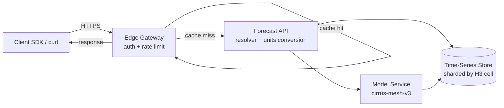

# Architecture

A Cirrus API request flows through four layers. Each is independently scalable; the edge fans out across regions and the time-series store is sharded by H3 cell.

## Request flow

## Layers

### Edge gateway

Terminates TLS, validates the bearer token, applies per-key rate limits, and serves a CDN cache with a 30-second TTL for current conditions and 5-minute TTL for forecasts. Runs in 14 regions; routing is anycast.

### Forecast API

Resolves the request (units conversion, language localization, default windowing), assembles the response from the time-series store, and fills any missing hours from the model service. Stateless; horizontally scaled.

### Model service

Runs the **cirrus-mesh-v3** forecast model every 6 hours, writing predictions back to the time-series store. The API doesn't call the model on the request path — predictions are always pre-computed.

### Time-series store

The TSDB stores both observations (from weather stations and satellites) and predictions. Sharded by H3 cell (resolution 5, ~9 km hexagons) so any location query hits at most 7 shards.

## Caching strategy

| Endpoint | Edge TTL | Origin TTL |
|---|---|---|
| `/v1/current` | 30s | 5min |
| `/v1/forecast` | 5min | 1h |
| `/v1/historical` | 24h | indefinite |

## Failure modes

- **Station offline**: Falls back to model data. Response includes `degraded: true`.
- **Model stale**: Returns last good model output with a `model_age` field.
- **Region down**: Anycast routes to the nearest healthy region; client sees a slightly higher latency but no error.

## See also

- [`/v1/current`](./endpoints/current.md)
- [`/v1/forecast`](./endpoints/forecast.md)
- [Authentication](./authentication.md)
