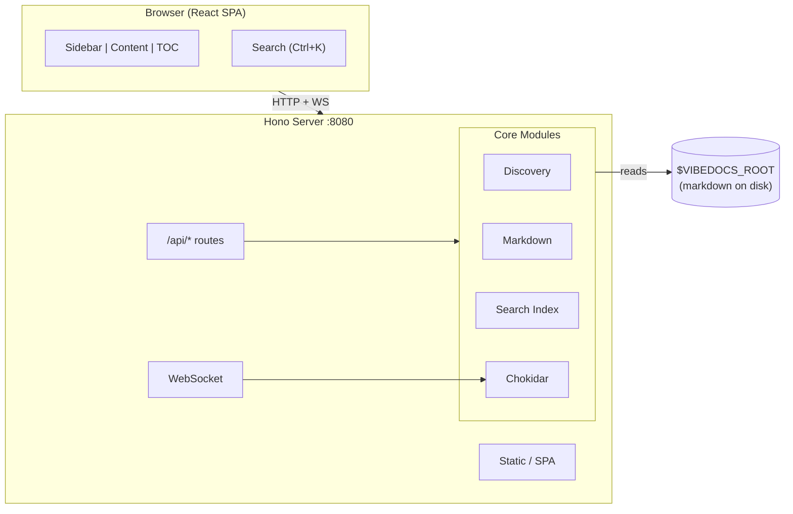

# Architecture

## Overview

vibedocs is a self-hosted documentation browser with a **Hono backend** and **React + shadcn/ui frontend**. It auto-discovers markdown files across all workspace projects and renders them with syntax highlighting, diagrams, and live reload.

## System Diagram



## Backend (src/)

### server.ts - HTTP Server

The main entry point. Uses Hono for routing on port 8080.

**API Routes:**
- `GET /api/projects` - Returns project list with file trees (calls `discovery.ts`)
- `GET /api/render/:project/*` - Renders markdown to HTML + TOC (calls `markdown.ts`)
- `GET /api/raw/:project/*` - Returns raw markdown content (for copy button)
- `GET /api/search?q=` - Full-text search across all indexed files (calls `search.ts`)
- `POST /api/upload/:project/*` - Upload files to a project folder (calls `upload.ts`)
- `GET /api/file/:project/*` - Serve non-markdown files with correct content types

**Static File Serving (production):**
- Serves `frontend/dist/` assets for all non-API routes
- SPA fallback: any unmatched GET returns `index.html` so hash routing works

**WebSocket:**
- Attached to the same HTTP server
- Broadcasts `reload` (file changed) and `refresh-tree` (file added/removed) messages

### discovery.ts - Project Discovery

Scans the configured root directory (`VIBEDOCS_ROOT`) for directories containing files. Builds a recursive file tree structure for each project. Excludes `node_modules`, `.git`, `dist`, and other non-documentation directories.

**Key types:**
- `FileNode` - `{ name, path, type: 'file' | 'folder', children?, isAsset? }`
- `ProjectInfo` - `{ name, hasDocsFolder, tree: FileNode[] }`

The tree includes all file types. Non-markdown files have `isAsset: true` so the frontend can show distinct icons and open them in a new tab instead of rendering inline. Root-level discovery (`getRootMarkdownFiles`) remains markdown-only to keep project top-level clean.

### upload.ts - File Upload

Handles file upload logic independent of the HTTP framework.

- `resolveUploadDir(projectsDir, project, folderPath)` - Resolves and validates the target directory with two-layer path traversal protection (validates both project name and folder path)
- `safeWriteFile(targetDir, originalName, data)` - Writes a file with filename sanitization (`path.basename`) and automatic conflict renaming (`file-1.ext`, `file-2.ext`, up to 100 suffixes)

### markdown.ts - Rendering Pipeline

Processes markdown through a unified/remark/rehype pipeline:

```
Markdown → remark-parse → remark-gfm → remarkMermaid (custom)
  → remark-rehype → @shikijs/rehype → rehype-slug
  → rehype-autolink-headings → rehype-stringify → HTML
```

- **Shiki** provides dual-theme syntax highlighting (github-light + github-dark)
- **remarkMermaid** converts ` ```mermaid ` blocks to `<div class="mermaid">` for client-side rendering
- **rehype-slug** + **rehype-autolink-headings** make headings linkable
- `extractToc(html)` parses h1-h3 headings from rendered HTML for the TOC

### search.ts - Full-Text Search

In-memory search index built on startup and rebuilt on file watcher events.

- Reads all `.md` files from discovered projects
- Stores lowercase content for case-insensitive matching
- `search(query)` scans content, returns matches with ~100 char context snippets
- Limited to 20 results per query

## Frontend (frontend/)

Built with **Vite + React 19 + TypeScript + shadcn/ui + Tailwind CSS v4**.

### Build & Dev

- **Development:** `npm run dev` starts both Hono (8080) and Vite dev server (5173) via `concurrently`. Vite proxies `/api/*` to the backend.
- **Production:** `npm run build` outputs to `frontend/dist/`. Hono serves it as static files.

### Component Architecture

```
App.tsx
├── ThemeProvider (light/dark/system, localStorage)
├── TooltipProvider
├── SidebarProvider
│   ├── AppSidebar
│   │   ├── ThemeToggle
│   │   ├── Filter Input
│   │   └── Project Tree (recursive Collapsible)
│   └── SidebarInset
│       ├── Header (SidebarTrigger + project name)
│       └── Content Area
│           ├── DocContent
│           │   ├── BreadcrumbNav
│           │   ├── Copy Button
│           │   ├── ConnectionStatus
│           │   └── Rendered HTML (prose-content)
│           └── TocPanel (scroll-spy)
└── SearchDialog (Ctrl+K command palette)
```

### Custom Hooks

| Hook | Purpose |
|------|---------|
| `use-projects` | Fetches `/api/projects`, returns project list with refresh |
| `use-document` | Fetches `/api/render/:project/:path`, returns HTML + TOC |
| `use-websocket` | Connects to WebSocket, handles reconnect, fires callbacks |
| `use-search` | Debounced fetch to `/api/search?q=`, returns results |

### Routing

Hash-based routing: `#project/path/to/file.md`. Parsed on load and on `hashchange` events. No client-side router library needed.

### Styling

- **Tailwind CSS v4** with `@tailwindcss/vite` plugin
- **shadcn/ui** components with CSS variables for theming
- **Custom `prose-content` class** in `index.css` for rendered markdown (headings, code blocks, tables, blockquotes, lists, etc.)
- **Shiki dual-theme** CSS: uses `--shiki-light` / `--shiki-dark` CSS variables, toggled by `.dark` class
- **Mermaid diagrams** rendered client-side via CDN import

### shadcn/ui Components Used

sidebar, command, dialog, breadcrumb, scroll-area, collapsible, button, input, tooltip, badge, separator, skeleton, dropdown-menu, resizable, sheet

## Data Flow

### Document Loading
1. User clicks file in sidebar → sets `window.location.hash`
2. `hashchange` event → `App.tsx` parses project + path
3. `use-document` hook fetches `/api/render/:project/:path`
4. Backend reads file, runs through markdown pipeline, extracts TOC
5. Returns `{ html, toc }` → React renders HTML + TOC panel

### Live Reload
1. Chokidar watches `$VIBEDOCS_ROOT/**/*` (all files)
2. Markdown change → broadcasts `{ type: 'reload' }` via WebSocket + rebuilds search index
3. Non-markdown change → broadcasts `{ type: 'refresh-tree' }` only
4. `use-websocket` hook receives message → triggers `use-document` or `use-projects` refresh
5. File upload endpoint also broadcasts `{ type: 'refresh-tree' }` after successful upload

### Search
1. User presses Ctrl+K → search dialog opens
2. Typing triggers debounced (250ms) fetch to `/api/search?q=`
3. Backend scans in-memory index for matches
4. Results grouped by project in the command palette
5. Selecting a result sets `window.location.hash` → navigates to document
